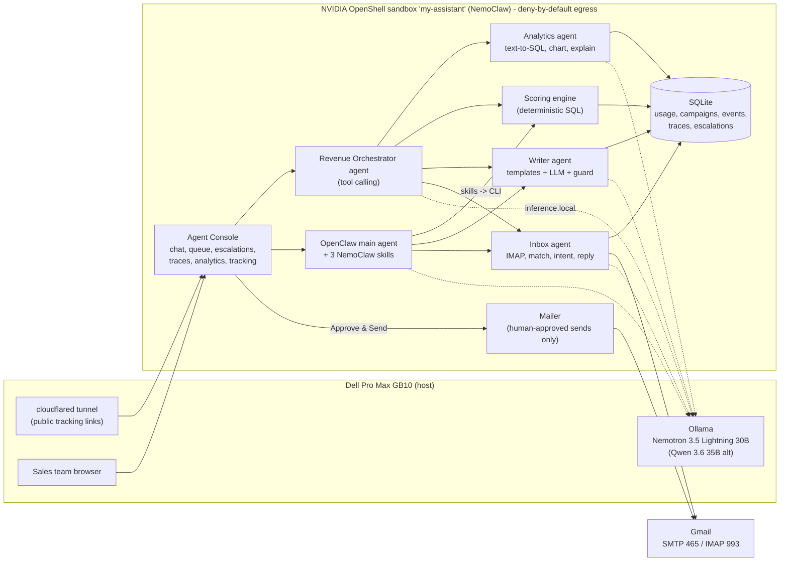
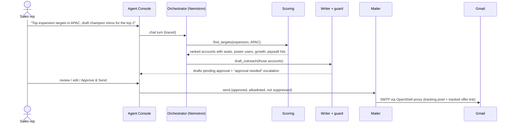
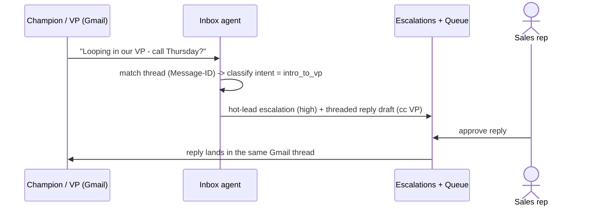

# FlowDesk Revenue Agents
### AI sales agents that run on local hardware, so a small sales team can work like a large one

> Dell × NVIDIA Hackathon. Local NVIDIA Nemotron models on a **Dell Pro Max GB10**, sandboxed by **NVIDIA OpenShell**, orchestrated with **NVIDIA NemoClaw / OpenClaw**.

The agents read a year of product-usage data and find which customers are ready to buy more. They draft personalized
outreach, send it through real Gmail **only after a human approves**, and track opens, clicks, replies and purchases.
They watch the inbox and draft replies for approval, and they hand anything that needs a person to an escalations
inbox in the dashboard. Every model call, tool call and decision is traced in the UI. **Customer data never leaves the box.**

---

## 1. Why this project

### The problem
Small and mid-sized software businesses already collect what they need to grow revenue: **product-usage data**. They
know who logs in every day, which teams outgrew their seats, who keeps hitting the paywall and whose usage is slipping.
They rarely act on it, because:

- **The sales team is tiny,** often the founder plus one or two reps, and no one has time to dig through usage tables every week.
- **Growth tools are expensive and generic.** They send untargeted "upgrade now" blasts that get roughly 2% replies.
- **Sending customer data to cloud AI is a hard no** for many of these businesses, whether for privacy, contracts or compliance.
- **Fully automated AI outreach is risky.** One invented number or a misfired email to a key account damages trust.

### Our answer
A **team of AI agents that runs on one local workstation**. It turns usage data into targeted and personalized
revenue outreach, and it keeps a human in control of every email that goes out.

| Without it | With FlowDesk Revenue Agents |
|---|---|
| A founder spends hours exporting CSVs to guess who to upsell | The analyst agent ranks accounts in seconds from 12 months of usage |
| Generic "upgrade now" blasts | Emails that quote the account's own numbers: "28 people use FlowDesk on 20 seats" |
| No idea who opened, clicked or replied | Open, click, reply and conversion tracking per email, campaign and segment |
| Replies sit unanswered for days | The inbox agent classifies each reply, drafts a response and escalates hot leads right away |
| Cloud AI sees all customer data | Nemotron runs locally on the GB10. The sandbox can reach only the local model and Gmail |
| "Did the AI just email our biggest customer?" | Nothing is sent without human approval, and every agent step is visible in the trace |

---

## 2. Who it's for

**Primary user: owners of small B2B SaaS and product businesses with small sales teams** (1–10 people in sales or
customer success). They have a product with real usage, a few hundred to a few thousand customers, and no data
team.

| Persona | What they need | What the product gives them |
|---|---|---|
| **Founder / business owner** | Revenue growth without hiring a growth team. Keep customer data private | A local "revenue team in a box" with a dashboard that shows MRR uplift |
| **Account executive / sales rep** | Know *who* to call and *what* to say. Spend time on deals, not research | Ranked targets, ready-to-approve drafts, hot-lead escalations |
| **Customer success manager** | Catch churn early and answer replies fast | Win-back segment, inbox triage, reply drafts in the same thread |
| **Ops / security owner** | AI that can't leak data or act on its own | Deny-by-default sandbox egress, approval gate, full audit trail |

---

## 3. The story

This is the scenario we designed and demo end to end.

1. **We have one year of usage data** for a B2B SaaS product called *FlowDesk*: 60 customer accounts, about 1,000 users,
   about 100k active-day records, plus geography, plans, billing and last year's marketing campaigns.
2. **The agents analyze usage** and find revenue opportunities:
   - **Enterprise expansion:** teams on the Team plan whose usage is growing past the seats they pay for, with
     many power users and frequent hits on Enterprise-only features (SSO, audit log, permissions);
   - **Pro upsell:** free-plan power users who hit limits every day;
   - **Win-back:** paying accounts whose usage is falling;
   - **Reactivation:** signups that went quiet.
3. **The B2B playbook.** For an expansion account, the sales team targets the **power user (the champion)** and asks for
   an **introduction to their VP**. The email carries the evidence: *"28 people at Echo Capital actively use FlowDesk on
   20 purchased seats (140% utilization), 13 daily power users, usage up 160% quarter over quarter, and your teams hit
   Team-plan limits 387 times (audit log, advanced permissions)."* A second template pitches the VP directly with the ROI of
   consolidating onto Enterprise.
4. **Prebuilt email templates** for each segment (`champion_intro`, `vp_enterprise_pitch`, `pro_upsell`, `winback`,
   `reactivation`). The local LLM personalizes only the opening and value paragraphs. **The numbers come from SQL, never
   from the model.**
5. **A human approves** each draft in the dashboard and can edit or reject it. Only then is it sent through Gmail.
6. **Tracking:** opens (pixel), clicks (tracked offer link), conversions (an "Start upgrade" button on the offer page),
   replies and unsubscribes, compared against last year's generic campaigns.
7. **Inbox monitoring:** the champion replies *"Happy to help, looping in our VP. Call Thursday?"* The inbox agent matches
   the reply to the original email, classifies it as `intro_to_vp`, raises a **hot-lead escalation**, and drafts a
   threaded reply that copies the VP. A human approves it, and it lands in the same Gmail thread.
8. **The VP replies** asking about Enterprise pricing for 40 seats and an SSO timeline. That's another hot lead, and
   another draft waits for approval.
9. **Everything runs locally:** Nemotron on the Dell GB10 through Ollama, agents inside an NVIDIA OpenShell sandbox,
   and NemoClaw/OpenClaw as the agent runtime.

---

## 4. Agent architecture



### The agents
| Agent | Role | Model use | Tools / outputs |
|---|---|---|---|
| **Revenue Orchestrator** | Chat agent for salespeople. Plans and calls tools | Nemotron tool calling | `query_analytics`, `find_targets`, `draft_outreach`, `approval_queue`, `check_inbox`, `campaign_report`, `escalate_to_human` |
| **OpenClaw main agent** (NemoClaw) | The same capabilities through NemoClaw-managed OpenClaw with skills | Nemotron via OpenShell route | Skills `outreach-analyst`, `outreach-writer`, `inbox-responder` (which wrap the CLI, including `escalate`) |
| **Analytics agent** | Answers any product-analytics question with SQL, a chart and an explanation | Text-to-SQL + explanation | Read-only SQLite, self-repair, check for row-multiplying joins, chart spec |
| **Scoring engine** | Finds power users and account expansion scores, and assigns segments | None (deterministic) | Facts used in emails |
| **Writer agent** | Personalizes prebuilt templates per account and audience | JSON personalization | `pending_approval` drafts with a rationale |
| **Inbox agent** | Polls Gmail, matches replies to threads, classifies intent, drafts replies | Classification + reply drafting | Reply drafts, suppression list, hot-lead escalations |
| **Mailer** (not an agent) | The only path that sends email | None | Requires human approval, allowlist and suppression checks. Adds tracking and threading headers |

### Human in the loop
- **The approval queue** is the only place emails get sent from. Every outbound email and every reply waits for a human, who can edit it.
- **The escalations inbox** collects what agents should not decide alone:

  | Escalation | Raised by | Severity |
  |---|---|---|
  | Hot lead: intro to VP, meeting request, pricing question | Inbox agent | high |
  | Interested reply or objection | Inbox agent | medium |
  | Drafts waiting for approval (closes itself once they're reviewed) | Writer agent | medium |
  | Blocked or failed send | Mailer | medium/high |
  | LLM output rejected by the guard (check wording) | Writer agent | low |
  | Deal won: hand off to an account executive | Tracking | high |
  | Anything the agent or OpenClaw flags (security review, pricing exception) | Orchestrator / OpenClaw | agent-chosen |

- **Agent traces:** every run records ordered steps: LLM calls (prompt, output, latency), tool calls (arguments,
  result), sub-agent runs, guard decisions and escalations. They stream live in the chat side panel and are browsable
  under *Agent traces*, including background agents and OpenClaw's own tool calls.

### Guardrails
| Guard | What it prevents |
|---|---|
| **Facts-only numbers** | Stats in emails come from SQL in template bullets. LLM paragraphs may not contain numbers, and the writer retries or falls back if they do |
| **Action-verification guard** | The agent claiming "I drafted the emails" without calling the tool. Its answer is rejected and it is made to call the tool |
| **SQL safety** | The analytics agent runs on a read-only connection with an authorizer that blocks anything but reads, a single statement and a time budget |
| **Join and empty-result repair** | Inflated totals from row-multiplying joins, and empty results caused by misspelled filter values |
| **Send gate** | Sending without approval, to a non-allowlisted recipient, or to an unsubscribed address |
| **Thread-aware inbox** | Replying to unrelated personal mail. Only replies to our own outreach are downloaded or stored |
| **OpenShell egress policy** | Data leaving the box. The sandbox can reach only `inference.local` and Gmail (Python only). GitHub, PyPI and everything else are blocked |

---

## 5. Workflows

### A. Find and pitch expansion accounts (B2B playbook)


### B. Reply to escalation to approved threaded response


### C. Product analytics in plain English
Ask *"How many active users do we have in each EMEA country over the last 30 days? Plot it."* The analytics agent
writes SQL, runs it read-only, repairs it if needed, picks a chart and explains the result. The UI shows the chart,
the explanation, the SQL and the raw rows, with a link to the trace.

### D. Track to report
Opens, clicks, conversions (with MRR uplift), replies and unsubscribes per email, comparing the **live agent
campaigns with last year's generic blasts**. A conversion also raises a "deal won" escalation for hand-off.

---

## 6. Tech stack

| Layer | Technology |
|---|---|
| Hardware | **Dell Pro Max with NVIDIA GB10** (Grace Blackwell), all inference local |
| Models | **NVIDIA Nemotron 3.5 Lightning 30B** (default; reasoning off, about 1–3 s per call) via **Ollama**. **Qwen 3.6 35B-A3B** as an alternative. `nemotron-embed-1b-v2` is available |
| Agent sandbox | **NVIDIA OpenShell**: deny-by-default network policy, Landlock filesystem rules, managed `inference.local` route to the local model |
| Agent runtime | **NVIDIA NemoClaw** + **OpenClaw** (`main` agent with custom skills, heartbeat), plus a custom tool-calling orchestrator |
| Email | Gmail SMTP and IMAP with app passwords, through NemoClaw's `gmail` policy preset (HTTP CONNECT tunnel through the OpenShell proxy) |
| Data | SQLite (WAL): 12-month synthetic usage dataset, campaigns, events, traces, escalations, chat history |
| Backend | Python 3 standard library only. No pip installs inside the sandbox |
| Frontend | Server-rendered HTML + vanilla JS chat console, **Chart.js** served locally (no CDN) |
| Public tracking | Cloudflare quick tunnel for open and click tracking from real inboxes |
| Testing | `unittest` offline pipeline tests, a Playwright browser smoke test, and a staged real-Gmail E2E test with a scripted customer (`customer_sim.py`) |

---

## 7. Results so far

Measured on the GB10 with real Gmail accounts:
- **The end-to-end Gmail run passed every stage:** egress boundary, data, analysis, drafting, approval and send,
  open/click/convert tracking, reply then intent then threaded reply, unsubscribe then suppression then blocked send,
  and an OpenClaw summary. 24 of 25 checks passed on the first run; the one miss was a bug in the test itself, which
  was then fixed.
- **Speed:** an email draft takes about 2 s, an analytics answer with chart about 4–9 s, a chat turn with tools about 5–15 s, and an
  OpenClaw turn with skills about 25–30 s.
- **Planted segments recovered exactly:** all 7 "viral team" accounts show up as expansion targets, and every other customer type maps to its intended segment.
- **Guards fired in real runs:** invented numbers were caught and rewritten, a "claimed but not done" draft was
  caught and executed, and a send to a non-allowlisted address was blocked.

---

## 8. Run it

```bash
# 0. Gmail sender with 2-Step Verification + App Password, saved OUTSIDE the repo (chmod 600):
#    ~/gmail_config.json  {"email": "you@gmail.com", "app_password": "xxxx xxxx xxxx xxxx"}
nemoclaw my-assistant policy add gmail --yes                    # python3 -> smtp/imap.gmail.com only
tmux new -d -s outreach-tunnel 'cloudflared tunnel --url http://127.0.0.1:8090'
scripts/configure.sh you@gmail.com champion@gmail.com vp@gmail.com https://<tunnel>.trycloudflare.com
GMAIL_CONFIG=~/gmail_config.json FRESH=1 scripts/deploy.sh      # upload, generate data, skills, dashboard, watcher
```
Open `http://127.0.0.1:8090` (or the tunnel URL from another device) and sign in as `admin` with the password in
`.dashboard_password`.

| Task | Command |
|---|---|
| Redeploy code (keep data) / restart services | `scripts/deploy.sh` / `scripts/deploy.sh restart` |
| Offline tests | `python3 -m unittest tests.test_pipeline -v` |
| Real-Gmail E2E | `scripts/e2e_test.sh` (or `STAGES="5 6 7" scripts/e2e_test.sh`) |
| Browser smoke test | `<venv>/bin/python tests/ui_smoke.py <url> <password> <outdir> "question" ...` |
| CLI (what the skills call) | `python3 -m outreach.cli analyze|draft|queue|inbox|report|escalate|egress-check` |
| Talk to OpenClaw directly | `nemoclaw my-assistant agent --agent main --session-id demo -m "..."` |

### Project layout
```
outreach/        agents: agent.py (orchestrator), analytics.py, scoring.py, writer.py, inbox.py,
                 mailer.py (send gate), traces.py (traces + escalations), templates.py, net.py, llm.py, cli.py
dashboard/       server.py (console, login, queue, escalations, traces, tracking) + static/app.js, Chart.js
skills/          OpenClaw skills: outreach-analyst, outreach-writer, inbox-responder
data/            generate_data.py (12-month dataset)      schema.sql   database schema
scripts/         deploy.sh, configure.sh, e2e_test.sh, customer_sim.py
tests/           test_pipeline.py, ui_smoke.py
```

---

## 9. Future work

**Product**
- **Connectors for real data:** Segment, Mixpanel/Amplitude, Postgres and warehouses, Stripe for billing, HubSpot or Salesforce for
  CRM sync (log emails, create opportunities from hot leads).
- **More channels:** LinkedIn tasks, Slack or Teams alerts for escalations (NemoClaw ships Slack and Teams presets), SMS.
- **Multi-step sequences:** automatic follow-ups when there's no reply in N days, A/B subject tests, send-time optimization.
- **Calendar booking:** turn "call Thursday?" into a proposed invite after approval.
- **Learning loop:** use reply and conversion outcomes to re-weight scoring and pick better templates per segment.
- **Multi-tenant with roles:** per-rep queues, approval policies (for example, auto-approve low-risk reminders), team leaderboards.

**AI and agents**
- **Specialist agents via NemoClaw's multi-agent manifest** (analyst, writer, inbox as separate OpenClaw agents with
  their own models), for example Nemotron Nano 4B for fast intent classification and the 30B model for writing.
- **Evaluation:** a golden set of analytics questions and reply intents, with regression scores per model (Nemotron vs Qwen).
- **Retrieval over product docs and past wins** (`nemotron-embed-1b-v2` is already on the box) for richer, grounded replies.
- **Fine-tuning** a small model on approved versus edited drafts, so it learns the team's voice from the approval queue.
- **Stronger grounding:** check that every number in a reply matches the facts, not only the outbound templates.

**Security and operations**
- **A separate sender sandbox:** move SMTP into its own OpenShell sandbox, so the agent sandbox physically cannot send.
- **Secrets through OpenShell providers** instead of files. OAuth instead of app passwords.
- **Durable hosting:** a named Cloudflare tunnel or your own domain, and Postgres instead of SQLite for multi-user scale.
- **OpenTelemetry export** of agent traces (NemoClaw has OTLP presets), plus compliance features: retention, audit export, GDPR delete.

---

## Safety notes
- **Synthetic recipients:** they use `.example` addresses and are rerouted to the sender's own plus-addresses. Only the configured test inboxes receive real mail.
- **Personal mail:** the inbox agent reads only headers, and downloads a message only if it replies to our outreach.
- **Credentials:** they live outside the repo (`~/gmail_*.json`) and are ignored by git. Revoke app passwords after demos.
- **Known limitation:** the agent and dashboard share one sandbox user, so the approval gate is enforced in software. The hard boundary is OpenShell egress (see Future work).
